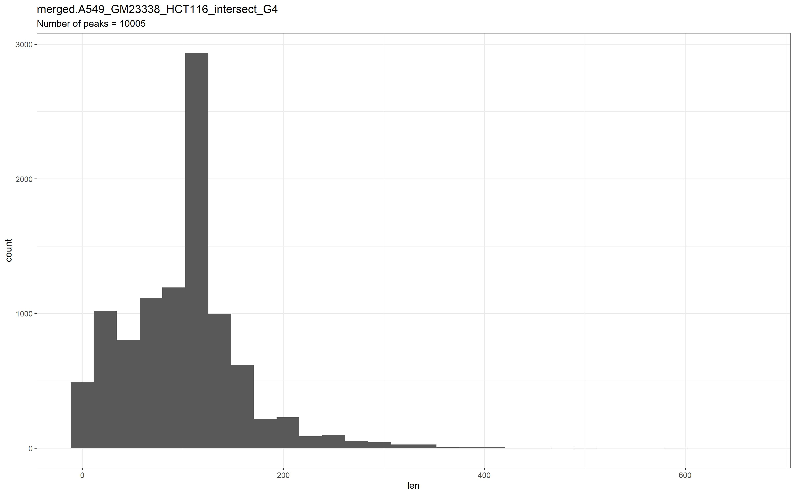
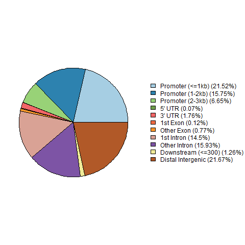
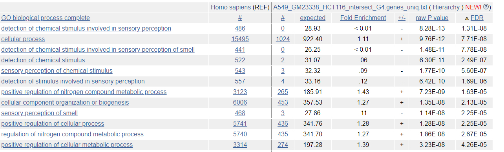

# hse21_H3K4me1_G4_human_group

### Состав группы
|         ФИ        | № группы  |                              github                              |
|:------------------|:---------:|:-----------------------------------------------------------------|
| Семенкович Тимофей|    2      | https://github.com/BaronFonMonc/hse21_H3K4me1_G4_human           |
| Филонов Всеволод  |    2      | https://github.com/manachat/hse21_H3K4me1_G4_human               |
| Горин Иван        |    2      | https://github.com/ivan-gorin/hse21_H3K4me1_G4_human             |

# Введение
**H3K4me1** - 

| Участник | Организм | Тип клетки | Эксперимент 1 | Эксперимент 2 | Вторичная стр-ра ДНК |  |
|--|--|--|--|--|--|--|
| Семенкович Тимофей | human | GM23338 |  |  | G4_seq_Li_K |  |
| Филонов Всеволод | human | HCT116 |  |  |  G4_seq_Li_K |  |
| Горин Иван | human | А549 | ENCFF379KHF | ENCFF675YHQ |  G4_seq_Li_K |  |

Все участники использовали геном человека, поэтому конвертация из генома мыши не потребовалась.
Все файлы пересечений были объединены с помощью bedtools intersect:
```
bedtools intersect -a H3K4me1_A549.intersect_with_G4.bed -b H3K4me1_GM23338.intersect_with_G4.bed > A549_GM23338_intersect_G4.bed
bedtools intersect -a A549_GM23338_intersect_G4.bed -b H3K4me1_HCT116_intersect_G4.bed > A549_GM23338_HCT116_intersect_G4.bed
```
Затем пики объединены с помощью bedtools merge:
```
sort -k1,1 -k2,2n A549_GM23338_HCT116_intersect_G4.bed | bedtools merge > merged.A549_GM23338_HCT116_intersect_G4.bed
```

# Распределение участков пересечений по длинам


# Pie-chart


# Визуализация данных в геномном браузере

Сохраненная сессия в UCSC GenomeBrowser: https://genome.ucsc.edu/s/Bruh/hse21_H3K4me1_G4_human_group 

# Ассоциация с генами и GO анализ
Ассоциация пиков с генами проведена с помощью скрипта ChIPpeakAnno.R. С генами было ассоциировано 1674 пика, всего уникальных генов: 1347.
Далее проведен GO анализ полученного списка генов.

Наиболее статистически значимые результаты:

